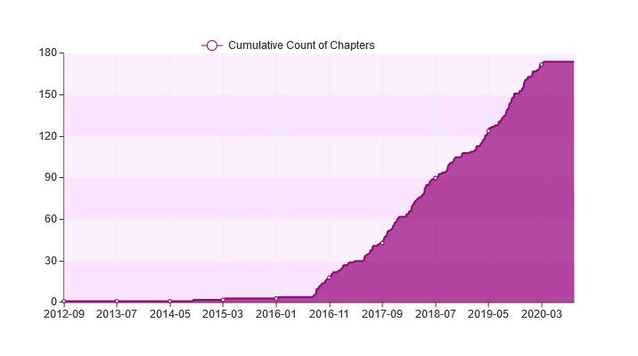
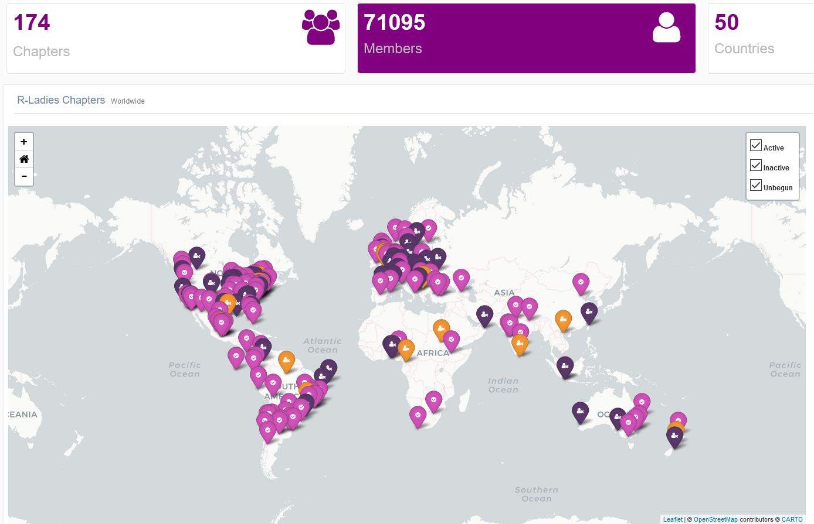
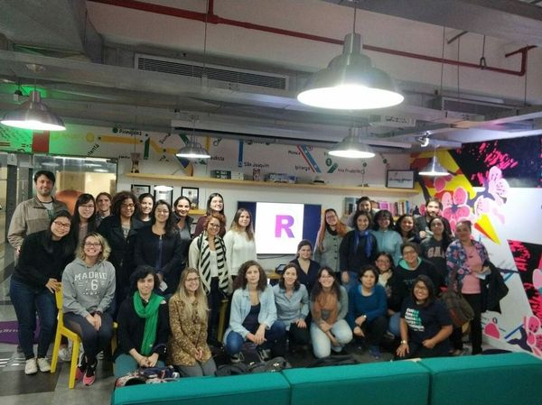
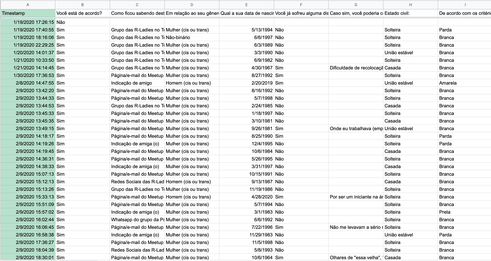
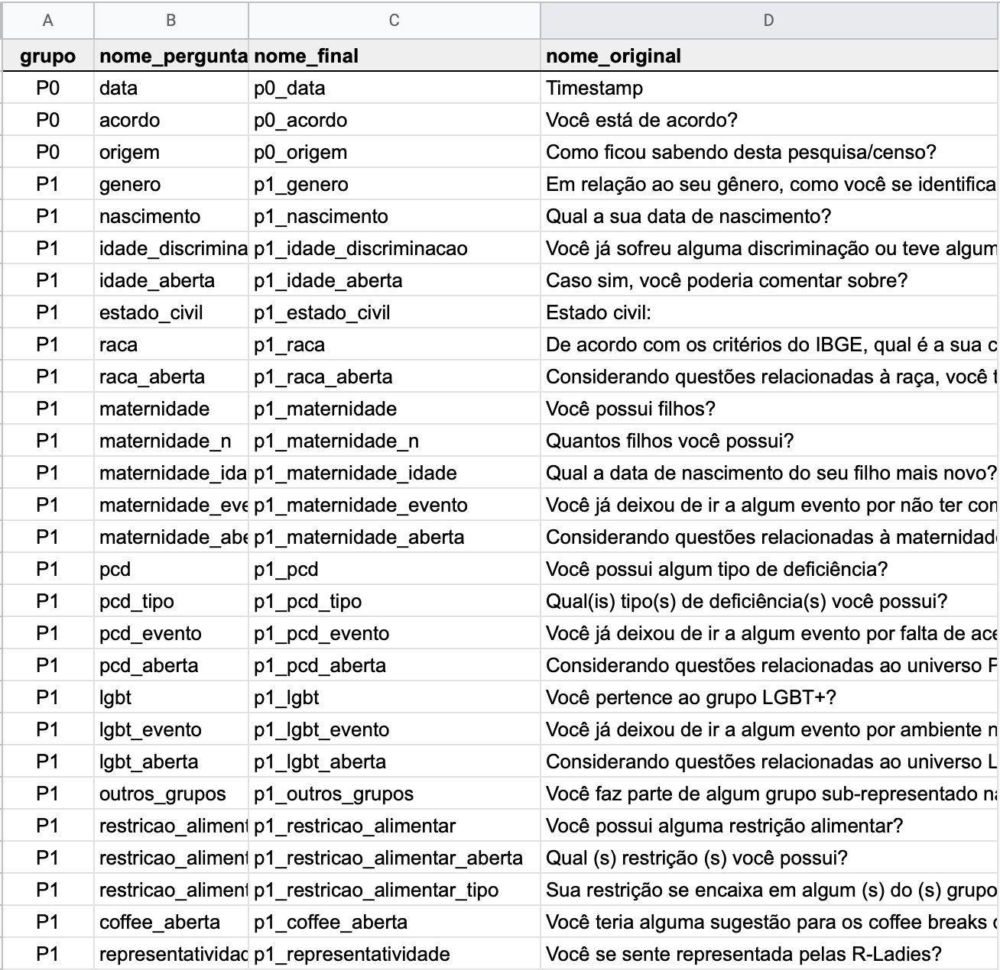
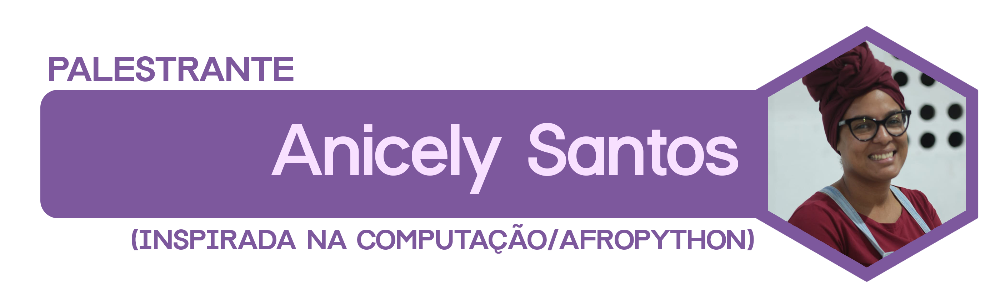
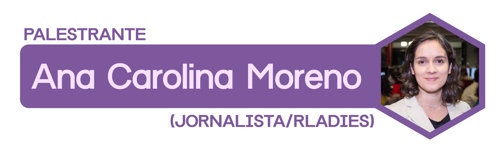
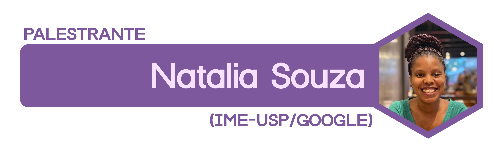
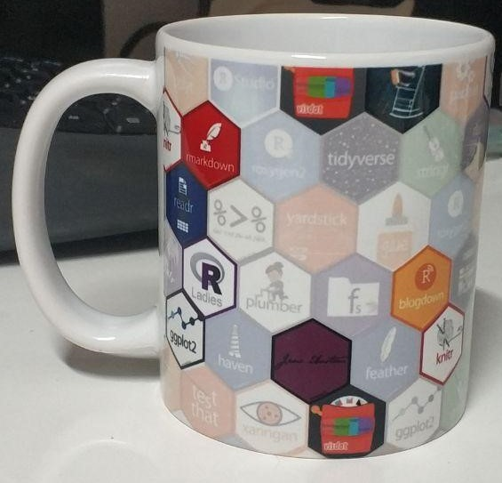
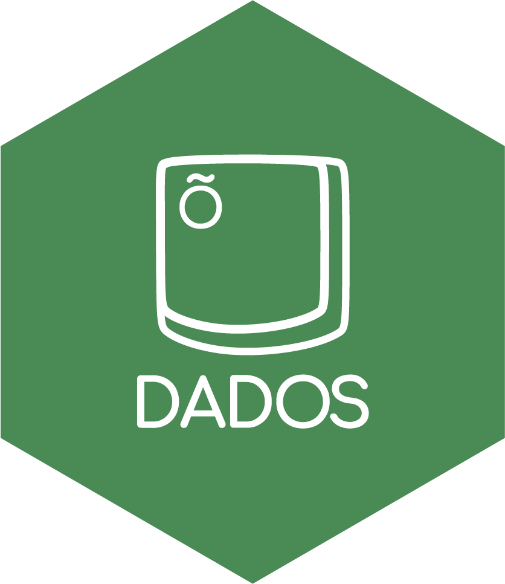

layout: true
  
<div class="my-footer"><span>


<a href="https://www.meetup.com/pt-BR/R-Ladies-Sao-Paulo">Meetup</a> |
<a href="https://twitter.com/RLadiesSaoPaulo">Twitter</a> | 
<a href="http://instagram.com/RLadiesSaoPaulo">Instagram</a> |
<a href="http://facebook.com/RLadiesSaoPaulo">Facebook</a> |
<a href="https://github.com/rladies/meetup-presentations_sao-paulo">GitHub</a> |
<a href="https://github.com/R-Ladies-Sao-Paulo/RLadies-Brasil">R-Ladies no Brasil</a> |
<a href="https://bit.ly/2020-18-rladies">bit.ly/2020-18-rladies</a> 


</span></div> 
---
class:

```{r setup, include=FALSE}
options(htmltools.dir.version = FALSE)

knitr::opts_chunk$set(fig.align = "center", message=FALSE, warning=FALSE)

library(tidyverse)
#library(dados)
# install.packages("devtools")
#devtools::install_github("gadenbuie/xaringanExtra")

```

```{r xaringan-fit-screen, echo=FALSE}
library(xaringanExtra)
xaringanExtra::use_fit_screen()
xaringanExtra::use_panelset()
```

```{r xaringanExtra-share-again, echo=FALSE}
xaringanExtra::use_share_again()
```

```{r metathis, echo=FALSE}
library(metathis)
meta() %>%
  meta_name("github-repo" = "R-Ladies-Sao-Paulo/2020-R-LadiesSP-2Anos") %>% 
  meta_social(
    title = "R-Ladies São Paulo - 2 anos",
    description = paste(
      "Apresentação do Meetup comemorativo de",
      " 2 anos da R-Ladies São Paulo"
    ),
    url = "https://r-ladies-sao-paulo.github.io/2020-R-LadiesSP-2Anos/",
    image = "https://r-ladies-sao-paulo.github.io/2020-R-LadiesSP-2Anos/img/share-card.png",
    image_alt = paste(
      "Primeiro slide da apresentação de ",
      " aniversário das R-Ladies São Paulo"
    ),
    og_type = "website",
    og_author = "R-Ladies São Paulo",
    twitter_card_type = "summary_large_image",
    twitter_creator = "@RLadiesSaoPaulo"
  )
```

# Programação

- Sobre as R-Ladies

- Sobre o Censo R-Ladies e leitura dos dados

- Resultados: Perfil sociodemográfico

  - TED Anicely Santos (InspirAda na Computação/Afropython)

- Resultados: Perfil socioeconômico

  - TED	Ana Carolina Moreno (jornalista/R-Ladies)

- Resultados: Escolaridade e ocupação

  - TED	Natalia Souza (IME-USP/Google)

- Resultados: Trajetórias e sugestões

- Mesa redonda

- Considerações finais	

---
class: center, middle, inverse

# R-Ladies

---
class:   

# Sobre as R-Ladies

## O que é o R-Ladies?

R-Ladies é uma organização mundial que promove a diversidade de gênero na comunidade da linguagem R.
R-Ladies São Paulo integra, orgulhosamente, a organização R-Ladies Global, em São Paulo.

## Como?

Através de meetups e mentorias em um ambiente seguro e amigável.

Nosso principal objetivo é promover a linguagem computacional estatística `R` compartilhando conhecimento, assim, quem tiver interesse na linguagem será bem-vinde, independente do nível de conhecimento. 


Fonte: [About us - R-Ladies](https://rladies.org/about-us/), [Meetup R-Ladies São Paulo](https://www.meetup.com/R-Ladies-Sao-Paulo/)


---
class:   

# Sobre as R-Ladies

## Para quem?

Nosso público-alvo são pessoas consideradas minorias de gênero, portanto, mulheres cis ou trans, homens trans, bem como pessoas não-binárias e queer.

## Missão

Como uma iniciativa de diversidade, a missão das R-Ladies é alcançar uma representação proporcional de pessoas de gêneros atualmente sub-representados na comunidade R, incentivando, inspirando e capacitando-as.

Fonte: [About us - R-Ladies](https://rladies.org/about-us/), [Meetup R-Ladies São Paulo](https://www.meetup.com/R-Ladies-Sao-Paulo/)

---
class:    

# Sobre as R-Ladies

## Como o R-Ladies começou?
```{r echo=FALSE, fig.align='center', out.width="20%"}
knitr::include_graphics("https://raw.githubusercontent.com/beatrizmilz/IV-SER-RLadies/master/docs/img/gabriela.jpeg")
```


**[Gabriela de Queiroz](https://github.com/gdequeiroz)** fundou o R-Ladies no dia **1 de outubro de 2012**. Ela queria retribuir à comunidade depois de ir à vários encontros e aprender muito de graça. O primeiro encontro R-Ladies foi realizado em ** San Francisco, Califórnia (Estados Unidos) **. Nos anos seguintes, mais capítulos do R-Ladies começaram em todo o mundo.

Fonte: [About us - R-Ladies](https://rladies.org/about-us/history/)

---
class:    

# Sobre as R-Ladies

## Crescimento da R-Ladies no mundo

```{r echo=FALSE, fig.align='center', out.width="80%"}

```

Atualizado em: Setembro/2020. Fonte: [R Community Explorer](https://benubah.github.io/r-community-explorer/rladies.html) 
---
class: 

# Sobre as R-Ladies

## Comunidade da R-Ladies - Capítulos no mundo
```{r echo=FALSE, out.width="70%"}

```

Atualizado em: Setembro/2020. Fonte: [R Community Explorer](https://benubah.github.io/r-community-explorer/rladies.html) 

---
class:    

# Sobre as R-Ladies

## Código de conduta
O R-Ladies dedica-se a proporcionar uma experiência livre de assédio para todas as pessoas participantes, desta forma, não é tolerada nenhuma forma de assédio.
[Código de conduta - R-Ladies](https://github.com/rladies/starter-kit/wiki/Code-of-Conduct#portuguese)


---
class:    

# R-Ladies no Brasil
```{r eval=FALSE, include=FALSE}
url <- "https://benubah.github.io/r-community-explorer/data/rladies.csv"
download.file(url, "data/rladies.csv", method = "curl")
```

```{r echo=FALSE, }
rladies <- readr::read_csv("data/rladies.csv")
```


Atualizado em: `r  format(Sys.time(), '%B de %Y')`. Fonte: [R Community Explorer](https://benubah.github.io/r-community-explorer/rladies.html) 

```{r echo=FALSE}
rladies %>%
  dplyr::arrange(desc(members)) %>%
  filter(country == "Brazil") %>%
  mutate(name = paste0("<a href='", fullurl, "' target='_blank'>", name, "</a>")) %>%
  select(
    -X1,
    -city,
    -region,
    -fullurl,
    -country,
    -created,
    -upcoming_events,
    -last_event,
    -past_events,
    -status
  ) %>%
  
  DT::datatable(autoHideNavigation = TRUE                ,
                options = list(pageLength = 7),
                  colnames = c("Capítulo", "Pessoas participantes"))
```

```{r include=FALSE}
pessoas_sp <- rladies %>% filter(city == "São Paulo") %>% select(members) %>% pull()
```

---
class: 

# R-Ladies em São Paulo

```{r echo=FALSE, out.width="50%"}

```


- **Primeiro encontro da R-Ladies São Paulo ** - Agosto/2018

- **+ `r pessoas_sp` pessoas participantes** - `r format(Sys.Date(), format='%B de %Y')`


---
class: center, middle, inverse

# Vamos começar?

---
class:

# Pré-requisitos

## `R` e `RStudio` instalados no seu notebook 

```{r, echo=FALSE, out.width="40%"}
knitr::include_graphics("img/rlogos/rstudio-r.jpg")
```

- Instale o R [fazendo o download aqui](https://cran.r-project.org/) e o RStudio [aqui](https://rstudio.com/products/rstudio/download/#download). Vamos usar os pacotes `tidyverse`, `googlesheets4`, `janitor` e `wordcloud`.


## ou pelo `RStudio Cloud`

- Através do link: [https://rstudio.cloud/project/1584702](https://rstudio.cloud/project/1584702)


```{r, echo=FALSE, out.width="40%"}
knitr::include_graphics("img/rstudiocloud.PNG")
```
---
class:   

# Analisando o Censo R-Ladies SP

## Sobre o Censo

- Período de coleta: de **19 de janeiro de 2020** a **06 de agosto de 2020**

- Divulgação na página do Meetup e grupo do Telegram

- 159 respondentes e 56 perguntas no total

- Anônimo (sem identificação de quem respondeu)

- Análise de forma aberta e colaborativa pela comunidade

---
class:   

# Analisando o Censo R-Ladies SP

## Fazendo a leitura dos dados

```{r echo=FALSE, out.width="95%"}

```
---
class:   

# Analisando o Censo R-Ladies SP

## Padronizando as colunas

```{r echo=FALSE, out.width="80%"}

```
---
class:   

# Analisando o Censo R-Ladies SP

## Vamos para o RStudio!

```{r echo=FALSE}

```
---
class: 

# TED

```{r echo=FALSE, out.width="100%"}

```

Apresentação da Anicely Santos [disponível neste link](https://docs.google.com/presentation/d/1F9goYOCrtsawyqJoeRcW8Y17g1FkrqaAN-Kjp5QXzA4/edit?usp=sharing).

---
class: 

# TED

```{r echo=FALSE, out.width="100%"}

```

Apresentação da Ana Carolina Moreno [disponível neste link](https://r-ladies-sao-paulo.github.io/2020-R-LadiesSP-2Anos/AnaCarolinaMoreno_dados_pandemia.pdf).

---
class:

# TED

```{r echo=FALSE, out.width="100%"}

```

---
class:

# Sorteio! E certificado :)


.panelset[
.panel[.panel-name[Formulário]
- Formulário para o certificado E sorteio: **[http://bit.ly/presenca-rladies](http://bit.ly/presenca-rladies)**


<center>
<iframe src="https://docs.google.com/forms/d/e/1FAIpQLSePXDbNHoV6Qo0COkt5SPAiE8phdE6gzNj33aF0Ucdhrjrr6w/viewform" height="100%" width="100%" style="min-height: 400px;"></iframe>
</center>

]

.panel[.panel-name[Caneca!]

```{r echo=FALSE, out.width="50%", fig.align='center'}

```

]


]


---
class: 

# TED

## Mesa Redonda

```{r echo=FALSE, out.width="60%"}


```

---
class: inverse, middle, center


# Considerações finais

---
class:

# Como contribuir/participar?

- Caso queira contribuir com a comunidade,  responda este [formulário abaixo](https://docs.google.com/forms/d/11G1EdaLbJi0hBuhpVpVQdyijDAXbdOuY7YSdHfLfMis/viewform?edit_requested=true).


<center>
<iframe src="https://docs.google.com/forms/d/11G1EdaLbJi0hBuhpVpVQdyijDAXbdOuY7YSdHfLfMis/viewform?edit_requested=true" height="100%" width="100%" style="min-height: 400px;"></iframe>
</center>

---
class:  

# Evento AI Inclusive - 17/09/2020

- [Se inscreva no Meetup](https://www.meetup.com/ai-inclusive-rio-de-janeiro/events/272966613/)!

```{r echo=FALSE, out.width="100%", fig.align='center'}

```


---
class:  

# Bolsas de diversidade de gênero

```{r echo=FALSE, out.width="50%", fig.align='center', fig.cap=""}
knitr::include_graphics("img/cursor1-41.png")
```


  
.pull-left[
- [Workshops](https://bit.ly/cursor-w-20202): 
  - Deploy
  - Introdução ao R com C++


- [Cursos](https://bit.ly/curso-r-c-20202):
  - R para Data Science I 
  - Introdução ao Machine Learning
  - Dashboards
  - Web Scraping
  - Deep Learning
]

.pull-right[

- [Curso-R](https://www.curso-r.com/):
  - [Fórum](https://discourse.curso-r.com/)
  - [Blog](https://www.curso-r.com/blog/)
  - [Livro](https://livro.curso-r.com/)
  - [Pacotes](https://www.curso-r.com/produtos/)

]


---
class:

# Pacote **dados**


.pull-left[
- [Disponível no GitHub](https://github.com/cienciadedatos/dados), em breve será submetido ao CRAN

- Objetivo: Disponibilizar diversas bases de dados traduzidas para o português

- Pacote em desenvolvimento, tradução realizada por R-Ladies do Brasil e Chile

- Como ajudar? Testando!

- Instalação do pacote `dados`:


]

.pull-right[

<!-- Atualizar antes do evento -->


```{r echo=FALSE, out.width="70%"}

```
]

```{r eval=FALSE, include=TRUE}
remotes::install_github("cienciadedatos/dados")
library(dados)
```

---
class:

# Questionário para América Latina

- Caso queira contribuir com a comunidade,  responda o [Questionário para América Latina 2020](https://rfoundation.limequery.com/189996?lang=pt-BR). 


<center>
<iframe src="https://rfoundation.limequery.com/189996?lang=pt-BR" height="100%" width="100%" style="min-height: 400px;"></iframe>
</center>


---
class: middle, center, inverse

# Resultado do sorteio!

---
class:   

# Como saber mais?

  - Website RLadies Global: [https://rladies.org/](https://rladies.org/)
  - Twitter: [@RLadiesGlobal](https://twitter.com/rladiesglobal), [@RLadiesSaoPaulo](https://twitter.com/RLadiesSaoPaulo)
  - Instagram: [@RLadiesSaoPaulo](http://instagram.com/RLadiesSaoPaulo)
  - Facebook: [@RLadiesSaoPaulo](http://facebook.com/RLadiesSaoPaulo)
  - MeetUp: [https://www.meetup.com/pt-BR/R-Ladies-Sao-Paulo](https://www.meetup.com/pt-BR/R-Ladies-Sao-Paulo)
  - Github: [https://github.com/rladies/meetup-presentations_sao-paulo](https://github.com/rladies/meetup-presentations_sao-paulo)
  - R-Ladies LATAM Blog (Latin America) - Em breve!
  - **[Capítulos da R-Ladies no Brasil, e eventos online](https://github.com/R-Ladies-Sao-Paulo/RLadies-Brasil)**

<center>
<h3> Não tem capítulo na sua cidade e quer iniciar um?</h3>


Saiba como em <a href="https://rladies.org/about-us/help/"> R-Ladies - How do get involved </a> </center>


- Apresentação feita com os pacotes [**xaringan**](https://github.com/yihui/xaringan) e [**xaringanExtra**](https://pkg.garrickadenbuie.com/xaringanExtra/)
- Tema `metropolis` modificado por [Bea Milz](https://beatrizmilz.com).
